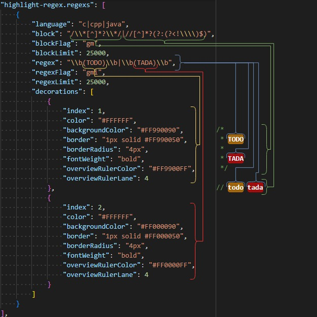
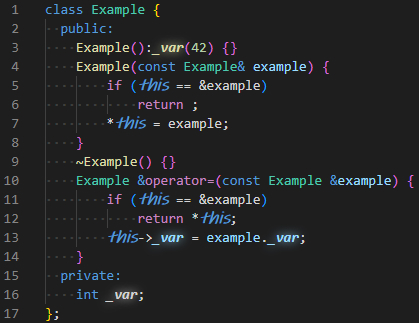

# Highlight regex

### Example 1
<p align="center">
  
</p>

### Example 2
```jsonc
"highlight-regex.regexs": [
    {
        "language": "c|cpp", // choose multi language
        "regex": "(?:['][^]*?(?:(?<!(?<!\\\\)\\\\)['])|[\"][^]*?(?:(?<!\\\\)[\"])|\\/\\*[^]*?\\*\\/|//[^]*?(?:(?<!\\\\)$)|#[^]*?(?:(?<!\\\\)$))|(\\b(?!__)_\\w+\\b)|(\\bthis\\b)", // regex string
        "regexFlag": "gm", // regex flag
        "regexLimit": 10000,
        "decorations": [
            {
                "index": 1,
                "fontWeight": "bold; text-shadow: 0px 0px 10px",
                "fontStyle": "italic"
            },
            {
                "index": 2,
                "fontWeight": "bold",
                "fontStyle": "italic; font-family: \"Ink Free\"; font-size:17.1px"
            }
        ]
    }
]
```

<p align="center">
  
</p>