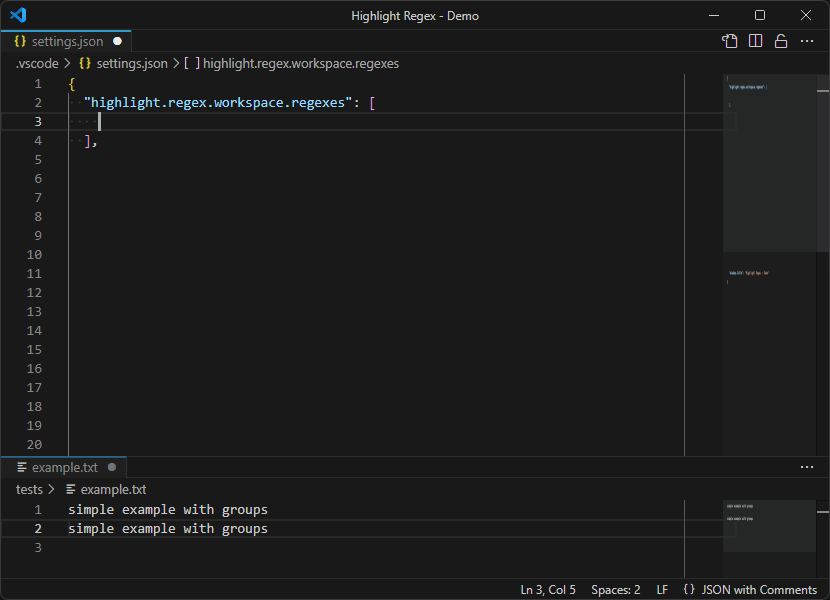

# Highlight regex

Highlight (*decorate*) what you want with Regex in VS Code



**Examples** available at [examples.md](examples.md)

## Choose by name(s)

Demo with **highlight.regex.choose.names** command.


## Commands

- **Highlight Regex: Toggle** (*highlight.regex.toggle*): Activate/Desactivate all scopes regexes.
- **Highlight Regex: Global Toggle** (*highlight.regex.global.toggle*): Activate/Desactivate all regexes of global scope.
- **Highlight Regex: Machine Toggle** (*highlight.regex.machine.toggle*): Activate/Desactivate all regexes of machine scope.
- **Highlight Regex: Workspace Toggle** (*highlight.regex.workspace.toggle*): Activate/Desactivate all regexes of workspace scope.
- **Highlight Regex: Choose by name(s)** (*highlight.regex.choose.names*): Activate/Desactivate specific regexes.

## Basic Settings

- **highlight.regex.cacheLimit**: Limit of cache (default is 1000).
- **highlight.regex.defaultRegexLimit**: Default limit of search regex (default is 50000).
- **highlight.regex.defaultRegexFlag**: Default regex flag (default is gm)
- **highlight.regex.delay**: Delay to applicate decorations after update events (in milliseconds) (default 200).

## Regexes Settings

The **regexes** property is a list of objects.  
The first object can include the following properties:
- **name**: A name of regexes.
- **description**: A description of regexes.
- **active**: Set to false for disable these regexes.
- **languageIds**: A list of language IDs used to apply child decorations.
- **languageRegex**: A regex pattern that, when matched with the language ID, applies child decorations.
- **filenameRegex**: A regex pattern that, when matched with the file path, applies child decorations.
- **regexes**: A list of objects with the following properties:
  - **regex**: The regex pattern to be applied (string or strings list).
  - **regexFlag**: The flag for the regex (default is **highlight.regex.defaultRegexFlag**).
  - **regexLimit**: The limit on how many matches the regex can find (default is **highlight.regex.defaultRegexLimit**).
  - **decorations**: A list of [VS Code decorations](https://code.visualstudio.com/api/references/vscode-api#DecorationRenderOptions)
    - Optionnal **index** property to indicate the index or name of the matched regex group.
    - Optionnal **hoverMessage** property to add a message or multiple message lines when hovering over a match group.
  - **regexes**: A list of child **regexes**.

### Default Regexes Setting
```jsonc
"highlight.regex.regexes": [
  {
    "name": "TODO/CRITICAL",
    "description": "Show todo and critical keyword on comment(s)",
    "languageRegex": "\\b(c|cpp|go|java|javascript|php|rust|typescript)\\b",
    "regexes": [
      {
        // regex to find all within comments
        "regex": [
          "(/\\*[^]*?\\*/)",
          "|",
          "(//[^]*?(?:(?<!\\\\)$))"
        ],
        "regexFlag": "gm",
        "regexLimit": 25000,
        "regexes": [
          {
            "index": 0, // 0 for take all regex match (this is optionnal)
            "regex": [
              "\\b(?<todo>TODO)\\b",
              "|",
              "\\b(CRITICAL)\\b"
            ],
            "regexFlag": "gmi",
            "regexLimit": 25000,
            "decorations": [
              {
                "index": "todo", // match regex named group (todo)
                "borderRadius": "4px",
                "fontWeight": "bold",
                "overviewRulerColor": "#FF9900FF",
                "overviewRulerLane": 4,
                "light": {
                  "color": "#000000",
                  "backgroundColor": "#FF990050",
                  "border": "1px solid #FF990090"
                },
                "dark": {
                  "color": "#FFFFFF",
                  "backgroundColor": "#FF990090",
                  "border": "1px solid #FF990050"
                }
              },
              {
                "index": 2, // (CRITICAL)
                "borderRadius": "4px",
                "fontWeight": "bold",
                "overviewRulerColor": "#FF0000FF",
                "overviewRulerLane": 4,
                "light": {
                  "color": "#000000",
                  "backgroundColor": "#FF000050",
                  "border": "1px solid #FF000090"
                },
                "dark": {
                  "color": "#FFFFFF",
                  "backgroundColor": "#FF990090",
                  "border": "1px solid #FF990050"
                }
              }
            ]
          }
        ]
      }
    ]
  }
]
```

<p align="center">
  
</p>