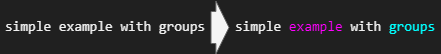
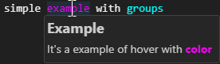
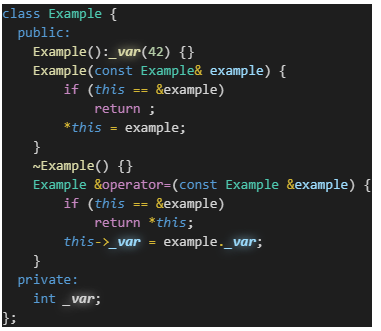
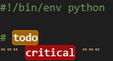
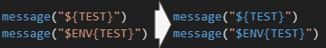
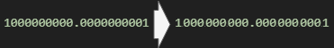
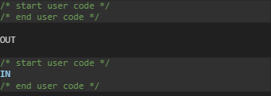

# Examples

## Simple example

```jsonc
"highlight.regex.regexes": [
    {
        "name": "Simple example",
        "regexes": [
            {
                "regex": "simple (?<example>example) with (groups)",
                "regexFlag": "gmi",
                "regexLimit": 10000,
                "decorations": [
                    {
                        "index": "example",
                        "color": "#F0F"
                    },
                    {
                        "index": 2, // groups
                        "color": "#0FF"
                    }
                ]
            }
        ]
    }
]
```

<p align="center">
  
</p>

## Simple example with hoverMessage

```jsonc
"highlight.regex.regexes": [
    {
        "name": "Simple hover message example",
        "regexes": [
            {
                "regex": "simple (?<example>example) with (?<groups>groups)",
                "regexFlag": "gmi",
                "regexLimit": 10000,
                "decorations": [
                    {
                        "index": "example",
                        "color": "#F0F",
                        "hoverMessage": [
                            "## Example\n",
                            "It's a example of hover ",
                            "with <span style=\"color:#F0F;\">**color**</span>"
                        ]
                    },
                    {
                        "index": "groups",
                        "color": "#0FF"
                    }
                ]
            }
        ]
    }
]
```

<p align="center">
  
</p>

## Highlight member variables in cpp and keyword this
```jsonc
"highlight.regex.regexes": [
    {
        "name": "Member variable (c,cpp)",
        "description": "Show member variable for c or cpp language",
        "languageIds": [ "c", "cpp" ],
        "regexes": [
            {
                "regex": [
                    "(?:",
                        "'(?:[^'\\\\]*(?:\\\\.[^'\\\\]*)*)'",
                        "|",
                        "\"(?:[^\"\\\\]*(?:\\\\.[^\"\\\\]*)*)\"",
                        "|",
                        "\\/\\*[^]*?\\*\\/",
                        "|",
                        "//[^]*?(?:(?<!\\\\)$)",
                        "|",
                        "#[^]*?(?:(?<!\\\\)$)",
                    ")",
                    "|",
                    "(?<var>\\b\\w+_(?<!__+)\\b)",
                    "|",
                    "(?<this>\\bthis\\b)"
                ], // not in string or comment or define
                "regexFlag": "gm",
                "regexLimit": 10000,
                "decorations": [
                    {
                        "index": "var", // \w+_
                        "fontWeight": "bold; text-shadow: 0px 0px 10px", // custom css
                        "fontStyle": "italic"
                    },
                    {
                        "index": "this", // this
                        "fontWeight": "bold",
                        "fontStyle": "italic"
                    }
                ]
            }
        ]
    }
]
```

<p align="center">
  
</p>

## Todo and Critical for python
```jsonc
"highlight.regex.regexes": [
    {
        "languageIds": [ "python" ],
        "regexes": [
            {
                "regex": "(\"\"\"[^]*?\"\"\")|(#[^]*?(?:(?<!\\\\)$))",
                "regexFlag": "gm",
                "regexes": [
                    {
                        "index": 0,
                        "regex": "(\\bTODO\\b)|(\\bCRITICAL\\b)",
                        "regexFlag": "gmi",
                        "decorations": [
                            {
                                "index": 1,
                                "borderRadius": "4px",
                                "fontWeight": "bold",
                                "overviewRulerColor": "#FF9900FF",
                                "overviewRulerLane": 4,
                                "light": {
                                    "color": "#000000",
                                    "backgroundColor": "#FF990050",
                                    "border": "1px solid #FF990090",
                                },
                                "dark": {
                                    "color": "#FFFFFF",
                                    "backgroundColor": "#FF990090",
                                    "border": "1px solid #FF990050",
                                }
                            },
                            {
                                "index": 2,
                                "borderRadius": "4px",
                                "fontWeight": "bold",
                                "overviewRulerColor": "#FF0000FF",
                                "overviewRulerLane": 4,
                                "light": {
                                    "color": "#000000",
                                    "backgroundColor": "#FF000050",
                                    "border": "1px solid #FF000090",
                                },
                                "dark": {
                                    "color": "#FFFFFF",
                                    "backgroundColor": "#FF000090",
                                    "border": "1px solid #FF000050",
                                }
                            }
                        ]
                    }
                ]
            }
        ]
    }
]
```
<p align="center">
  
</p>

## CMake variable in string
```jsonc
"highlight.regex.regexes": [
    {
        "languageIds": ["cmake"],
        "regexes": [
            {
                "regex": [
                    "(?:",
                        "#\\[\\[[^]*?\\]\\]",
                        "|",
                        "#[^]*?(?:(?<!\\\\)$))",
                        "|",
                        "(?<string>\"[^]*?(?:(?<!\\\\))\"",
                    ")"
                ],
                "regexFlag": "gm",
                "regexes": [
                    {
                        "index": "string",
                        "regex": "[\\$](?:ENV)?[{]\\w+[}]",
                        "decorations": [
                            {
                                "color": "#569CD6"
                            }
                        ]
                    }
                ]
            }
        ]
    }
]
```

<p align="center">
  
</p>

## Easy read big number
```jsonc
"highlight.regex.regexes": [
    {
        "regexes": [
            {
                "regex": "(?:[#][0-9a-zA-Z]*|((?<![.,][0-9]*)[0-9]{4,}))",
                "regexes": [
                    {
                        "index": 1,
                        "regex": "^\\d?\\d?(\\d{3})?(\\d{3})?(\\d{3})?(\\d{3})?(\\d{3})?$",
                        "regexFlag": "g",
                        "decorations": [
                            {
                                "index": 1,
                                "before": {
                                    "contentText": ".",
                                    "margin": "0px; font-size: 3px"
                                }
                            },
                            {
                                "index": 2,
                                "before": {
                                    "contentText": ".",
                                    "margin": "0px; font-size: 3px"
                                }
                            },
                            {
                                "index": 3,
                                "before": {
                                    "contentText": ".",
                                    "margin": "0px; font-size: 3px"
                                }
                            },
                            {
                                "index": 4,
                                "before": {
                                    "contentText": ".",
                                    "margin": "0px; font-size: 3px"
                                }
                            },
                            {
                                "index": 5,
                                "before": {
                                    "contentText": ".",
                                    "margin": "0px; font-size: 3px"
                                }
                            }
                        ]
                    }
                ]
            },
            {
                "regex": "(?:[#][0-9a-zA-Z.]*|((?:(?<![.])[.,])[0-9]{4,}))",
                "regexes": [
                    {
                        "index": 1,
                        "regex": "^[.,](\\d{3})?(\\d{3})?(\\d{3})?(\\d{3})?(\\d{3})?\\d?\\d?$",
                        "regexFlag": "g",
                        "decorations": [
                            {
                                "index": 1,
                                "after": {
                                    "contentText": ".",
                                    "margin": "0px; font-size: 3px"
                                }
                            },
                            {
                                "index": 2,
                                "after": {
                                    "contentText": ".",
                                    "margin": "0px; font-size: 3px"
                                }
                            },
                            {
                                "index": 3,
                                "after": {
                                    "contentText": ".",
                                    "margin": "0px; font-size: 3px"
                                }
                            },
                            {
                                "index": 4,
                                "after": {
                                    "contentText": ".",
                                    "margin": "0px; font-size: 3px"
                                }
                            },
                            {
                                "index": 5,
                                "after": {
                                    "contentText": ".",
                                    "margin": "0px; font-size: 3px"
                                }
                            }
                        ]
                    }
                ]
            }
        ]
    }
]
```

<p align="center">
  
</p>

## Code block
```jsonc
"highlight.regex.regexes": [
    {
        "languageIds": [
            "cpp"
        ],
        "regexes": [
            {
                "regex": "/\\* start user code \\*/[^]*?(?:/\\* end user code \\*/)",
                "decorations": [
                    {
                        "backgroundColor": "#FFFFFF10",
                        "overviewRulerColor": "#FFFFFF50",
                        "overviewRulerLane": 4,
                        "isWholeLine": true
                    }
                ]
            }
        ]
    }
]
```

<p align="center">
  
</p>
